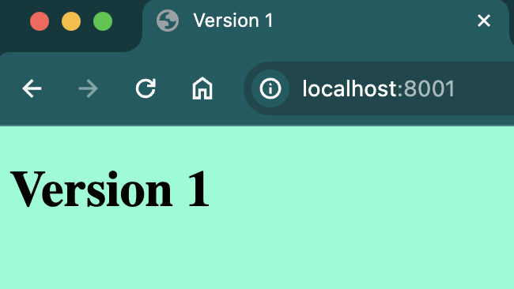
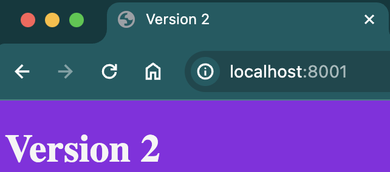
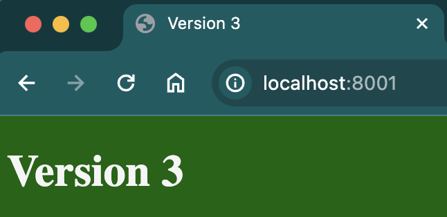
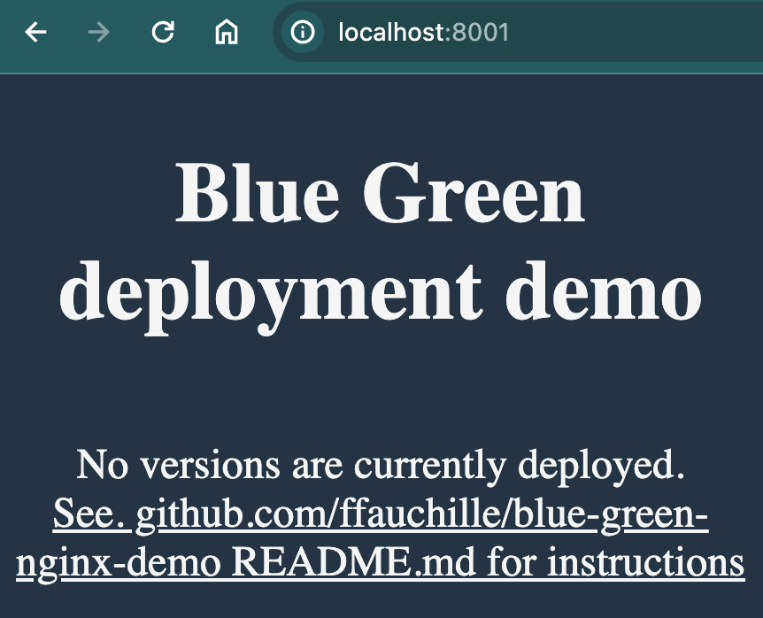

# Blue Green Deployment demo

**Objectives**:

- implement a simple blue green deployment on minimal web applications (only one html file)

## Overview

We have 3 version of the same minimal web application:

- Version 1:
  
- Version 2:
  
- Version 3:
  

We have a docker compose starting an nginx server with custom configurations:

- `blue.conf` which serve the `index.html` file inside the `/usr/share/nginx/html/blue` folder
- `green.conf` which serve the `index.html` file inside the `/usr/share/nginx/html/green` folder
- `site-enable.conf` which configures nginx to include the `/etc/nginx/sites-enabled/active.conf` file and failover to the `initial-state.html` file

To switch between versions of applications, we simply need to move the `application-versions/vX/index.html` to the next active color, and reconfigure nginx to serve the next color.
This is all done inside the bash script `deploy-scripts/blue-green-deployment.bash`

## Run blue green deployments

- Start the demo container and set the initial state before applying blue green deployment:

```sh
docker compose up -d
```

- Make sure you see the initial state with `No version deployed` html page visiting localhost:8001/
  
- deploy the version 1 app:

```sh
docker compose exec -it blue-green bash /code/deploy-scripts/blue-green-deployment.bash v1
```

- you should see version 1 app visiting localhost:8001/
  
- and the active color should be `blue`:

```sh
docker compose exec blue-green cat /code/active-color.txt
> blue
```

- deploy the version 2 app

```sh
docker compose exec -it blue-green bash /code/deploy-scripts/blue-green-deployment.bash v2
```

- while deploying (takes approx 10seconds), you can refresh localhost:8100/ and witness 0 downtime (should be still on version 1 while deploying)
- once deployment is done, you should see version 2 of the app:
  
- and the active color should now be `green`

```sh
docker compose exec blue-green cat /code/active-color.txt
> green
```

- deploy version 3:

```sh
docker compose exec -it blue-green /code/deploy-scripts/blue-green-deployment.bash v3
```

- after approx. 10sec, you should see version 3
  

- and the active color should be back to `blue`:

```sh
docker compose exec blue-green cat /code/active-color.txt
> blue
```

> Note: feel free to repeat the process by deploying a previous version, it should switch color everytime and serve the correct version

**Conclusion**: this very simple demo demonstrate how to implement blue green deployment with a small bash deployment script.
